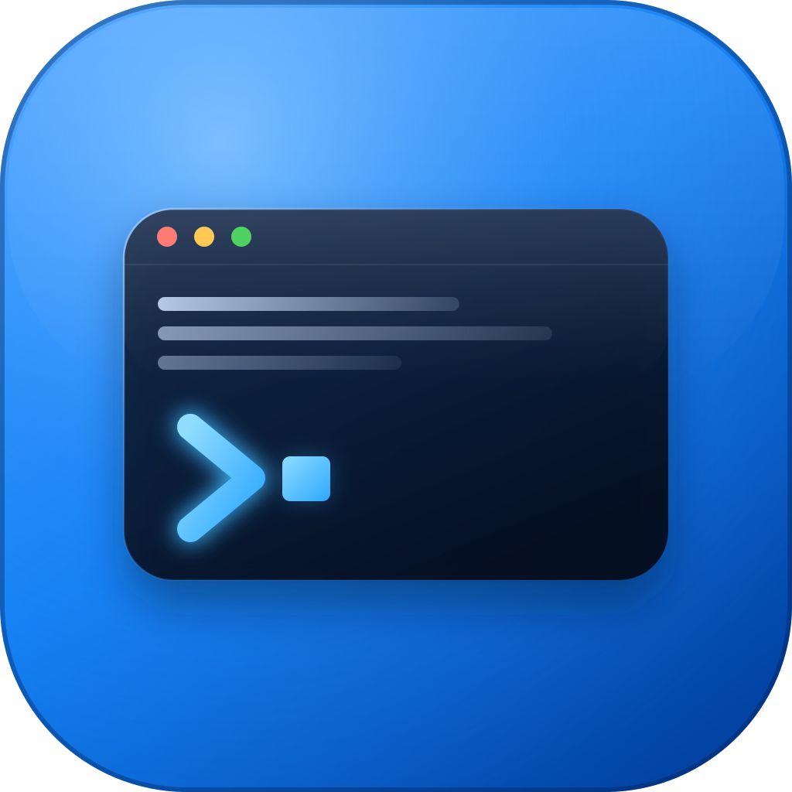

 <p align="center">
    
</p>

<h1 align="center">RemCmd</h1>

<p align="center">
    A GPU-accelerated SSH terminal and SFTP client built with Rust.
    <br />
    <a href="https://github.com/bianwoyali-design/RemCmd/actions/
    workflows/ci.yml"></a>
    <a href="LICENSE"></a>
    
    <a href="https://www.rust-lang.org/"></a>
</p>

## About

RemCmd is a GPU-accelerated SSH terminal and SFTP client built with Rust and
GPUI. It combines saved SSH connections, interactive terminal sessions, split
panes, remote file management, and local terminals in one desktop application.

RemCmd is currently in beta. Download the latest build from the
[GitHub Releases page](https://github.com/bianwoyali-design/RemCmd/releases).

## Highlights

- SSH Password, Private Key, and Passwordless authentication on every
  supported platform, plus Unix-socket SSH Agent authentication on macOS and
  Linux.
- Host-key verification backed by `~/.ssh/known_hosts`, including explicit
  first-use fingerprint review.
- Interactive ANSI terminal with scrollback, selection, clipboard support,
  tabs, and nested split panes.
- Local terminal tabs and a Quick Command panel that sends one command to
  selected connected servers.
- SFTP browser with tree navigation, multi-selection, recursive transfer,
  editable text files, conflict checks, progress, cancellation, concurrency,
  and bandwidth limits.
- Per-server Linux performance monitoring for CPU, memory, swap, disk I/O,
  process counts, and sampling latency.
- Light, Dark, and System themes, configurable terminal font settings, and
  horizontal or vertical terminal tabs.

## Install

Release assets are currently available for:

| Platform | Download | Notes |
|----------|----------|-------|
| macOS | `RemCmd-v*-macos-aarch64.dmg` | For Apple Silicon Mac |
| Linux | `RemCmd-v*-linux-x86_64.deb` | For Debian/Ubuntu Linux Distro |
| Linux | `RemCmd-v*-linux-x86_64.AppImage` | For Linux running directly |
| Windows | `RemCmd-v*-windows-x86_64.msi` | For Windows Installer |

See the [installation guide](docs/installation.md) for platform-specific
steps and beta limitations. macOS users should also read the
[macOS installation notes](docs/macos-installation.md).

## First Connection

1. Open **New Connection** and enter the server host, port, and user.
2. Choose Password, Private Key, Passwordless, or SSH Agent authentication.
   SSH Agent currently requires macOS or Linux and `SSH_AUTH_SOCK`.
3. Connect and verify an unknown host-key fingerprint before trusting it.
4. Open **Remote Files** after connection when the server offers an SFTP
   subsystem.

Reusable passwords and private-key passphrases are saved only after successful
authentication in the operating system keychain. They are never written to the
profile JSON file.

## Build From Source

### Prerequisites

RemCmd requires **Rust 1.96.1** (install via [rustup](https://rustup.rs/)).

**macOS** — Xcode Command Line Tools:

**Linux (Debian / Ubuntu)**:

```bash
sudo apt-get update
sudo apt-get install -y \
     libegl1-mesa-dev \
     libfontconfig1-dev \
     libwayland-dev \
     libx11-xcb-dev \
     libxkbcommon-dev \
     libxkbcommon-x11-dev \
     libdbus-1-dev \
     pkg-config
```

**Windows** — MSVC toolchain (ships with Visual Studio Build Tools).

### Build & run

Clone this repository first.

```bash
cargo run -p remcmd-app
```

For the workspace checks used by CI:

```bash
cargo fmt --all -- --check
cargo clippy --workspace --all-targets -- -D warnings
cargo test --workspace
```

## Data Storage

App data lives under the platform-standard directory:

| Platform | Path |
|----------|------|
| macOS | `~/Library/Application Support/RemCmd/` |
| Linux | `~/.local/share/RemCmd/` |
| Windows | `%APPDATA%\RemCmd\` |

## Documentation

- [Installation](docs/installation.md)
- [macOS installation](docs/macos-installation.md)
- [Windows packaging and future signing](docs/windows-code-signing.md)
- [Release process](docs/releasing.md)
- [Roadmap](ROADMAP.md)
- [Changelog](CHANGELOG.md)

## License

RemCmd is licensed under [Apache-2.0](LICENSE).
